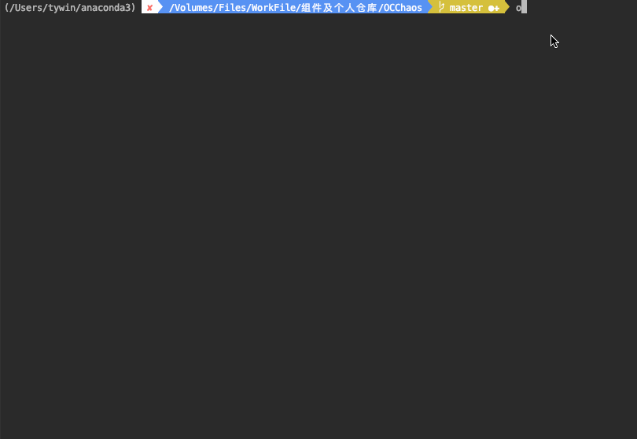

# OCChaos
===========================

----
使用一种廉价的方式来实现在iOS马甲包制作过程中，修改文件md5值，前后缀修改，垃圾代码生成，垃圾代码加入工具。
----



###########环境依赖

不支持python2

###########安装步骤

*python要在3以上版本

```
pip install occhaos
```

########### 使用步骤

```
occhaos
```
